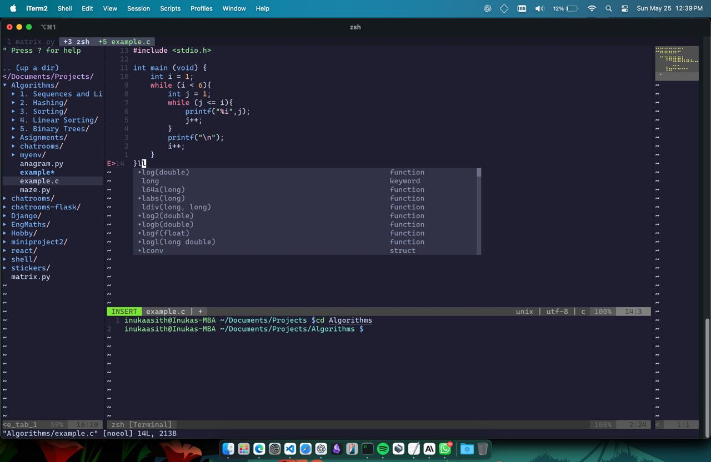

# Vim++

## Supercharge your vim




A feature-rich Vim configuration that transforms Vim into a modern IDE-like experience with VSCode-inspired functionality, Autocomplete support, and a clean/minimal toggle mode.

## ✨ Features

### 🎯 Core Features
- **VSCode-like Workspace**: Project folder management with sidebar and integrated terminal
- **Autocomplete Integration**: Language Server Protocol support with toggle functionality
- **Smart Completion**: Enhanced autocompletion with multiple sources
- **Terminal Tabs**: Multiple terminal instances with tab management
- **Fuzzy Finding**: Fast file navigation with FZF
- **Git Integration**: Built-in Git commands and status
- **Visual Enhancements**: Modern colorscheme, minimap, and statusline
- **Clean Mode Toggle**: Switch between full-featured and minimal Vim with `<Leader>z`

### 🧹 Clean Mode
- Toggle between full IDE features and minimal Vim
- Persistent preference (remembers your choice between sessions)
- Perfect for distraction-free editing or when working on remote servers

### 🏢 Workspace Management
- Initialize workspace from any directory
- Project-aware file opening
- Session saving and loading
- VSCode-like layout with sidebar and terminal

## 📦 Installation

### 1. Prerequisites
### 1)  Install Vim

#### macOS
```bash
brew install vim
```

#### Ubuntu/Debian
```bash
sudo apt install -y vim
```

#### Fedora
```bash
sudo dnf install -y vim
```

#### CentOS/RHEL
```bash
sudo yum install -y vim
```

### 2) Clone the Vim++ Configuration

```bash
git clone https://github.com/inukaasith/vim-plus-plus.git ~/vim-plus-plus
```

### 3) Install Vim-Plug (Plugin Manager)
```bash
# For Vim
curl -fLo ~/.vim/autoload/plug.vim --create-dirs \
    https://raw.githubusercontent.com/junegunn/vim-plug/master/plug.vim

# For Neovim
sh -c 'curl -fLo "${XDG_DATA_HOME:-$HOME/.local/share}"/nvim/site/autoload/plug.vim --create-dirs \
       https://raw.githubusercontent.com/junegunn/vim-plug/master/plug.vim'
```

### 4) Install Required System Dependencies

**macOS (using Homebrew):**
```bash
# Install Homebrew if not already installed
/bin/bash -c "$(curl -fsSL https://raw.githubusercontent.com/Homebrew/install/HEAD/install.sh)"

# Install dependencies
brew install fzf ripgrep node
brew install --HEAD universal-ctags/universal-ctags/universal-ctags
```

**Ubuntu/Debian:**
```bash
sudo apt update
sudo apt install -y curl git nodejs npm python3-pip
sudo apt install -y fzf ripgrep universal-ctags
```

**CentOS/RHEL/Fedora:**
```bash
# For Fedora
sudo dnf install -y curl git nodejs npm python3-pip fzf ripgrep ctags

# For CentOS/RHEL (enable EPEL first)
sudo yum install -y epel-release
sudo yum install -y curl git nodejs npm python3-pip fzf ripgrep ctags
```

**Windows (using WSL recommended):**
```bash
# Install WSL2 and Ubuntu, then follow Ubuntu instructions above
# Or use Windows Subsystem for Linux
```

### 5) Install Language Servers (Optional)

#### Python LSP
```bash
pip3 install 'python-lsp-server[all]'
# Alternative: pip install pylsp

# if pip doent enabled
sudo apt install python3-pylsp

```

#### JavaScript/TypeScript LSP
```bash
npm install -g typescript typescript-language-server
```

#### C/C++ LSP
```bash
# macOS
brew install llvm

# Ubuntu/Debian
sudo apt install -y clangd

# Fedora
sudo dnf install -y clang-tools-extra

# CentOS/RHEL
sudo yum install -y clang-tools-extra
```

### 6) Additional Language Servers (Optional)
```bash
# Bash LSP
npm install -g bash-language-server

# HTML/CSS LSP
npm install -g vscode-langservers-extracted

# Go LSP (if you work with Go)
go install golang.org/x/tools/gopls@latest

# Rust LSP (if you work with Rust)
rustup component add rust-analyzer
```

### 7) Install Vim Configuration

1. **Backup existing configuration:**
```bash
mv ~/.vimrc ~/.vimrc.backup
mv ~/.vim ~/.vim.backup
```

2. **Copy the configuration:**
```bash
# Copy the provided .vimrc to your home directory
cp ./vim-plus-plus/vimrc ~/.vimrc
```

3. **Install plugins:**
```bash
# Open Vim and run
vim +PlugInstall +qall
```

### 8) Optional: Install Minimap (for code overview)
```bash
# macOS
brew install code-minimap

# Ubuntu/Debian (build from source)
git clone https://github.com/wfxr/code-minimap.git
cd code-minimap
cargo install --path .

# Or download binary from releases
wget https://github.com/wfxr/code-minimap/releases/latest/download/code-minimap-linux
chmod +x code-minimap-linux
sudo mv code-minimap-linux /usr/local/bin/code-minimap
```

## 🚀 Quick Start

1. **Open Vim in any directory:**
```bash
vim
```

2. **Initialize workspace** (VSCode-like experience):
```
<Leader>wr    " Initialize workspace in current directory
<Leader>wo    " Initialize workspace in another directory
<Leader>ll    " Setup workspace layout
```

3. **Toggle features:**
```
<Leader>z     " Toggle Clean Mode (minimal vs full features)
<Leader>l     " Toggle Autocomplete on/off
<Leader>t     " Toggle Terminal on/off
F8            " Toggle minimap (Scrollbar)

```

## ⌨️ Keyboard Shortcuts

### 🎛️ Mode & Feature Toggles
| Shortcut | Action |
|----------|--------|
| `<Leader>z` | Toggle Clean Mode (minimal/full features) |
| `<Leader>l` | Toggle LSP (Language Server Protocol) |
| `<Leader>ls` | Show LSP status |
| `<Leader>li` | Show LSP info |
| `F8` | Toggle minimap |

### 📁 File & Project Management
| Shortcut | Action |
|----------|--------|
| `<Leader>ff` | Find files (FZF) |
| `<Leader>fg` | Find Git files |
| `<Leader>fb` | Browse open buffers |
| `<Leader>fl` | Search lines in current buffer |
| `<Leader>fw` | Search word in project (Ripgrep) |
| `<Leader>wo` | Open project folder |
| `<Leader>wr` | Initialize workspace |
| `<Leader>ws` | Save workspace session |
| `<Leader>wl` | Load workspace session |
| `<Leader>of` | Smart file open |
| `Ctrl+n` | Toggle NERDTree (file explorer) |
| `<Leader>nf` | Find current file in NERDTree |
| `<Leader>nr` | Refresh NERDTree |

### 🗂️ Tab & Buffer Management
| Shortcut | Action |
|----------|--------|
| `Ctrl+t` | New tab |
| `Ctrl+w` | Close current buffer |
| `<Leader><Tab>` | Next buffer |
| `<Leader><Shift+Tab>` | Previous buffer |
| `<Leader>1-9` | Go to buffer 1-9 |
| `H` | Previous buffer (like browser) |
| `L` | Next buffer (like browser) |
| `<Leader>wo` | Close other windows |
| `<Leader>wa` | Close all buffers except current |

### 🖥️ Terminal Management
| Shortcut | Action |
|----------|--------|
| `<Leader>t` | Toggle terminal |
| `Ctrl+\`` | Toggle terminal (alternative) |
| `<Leader>tn` | Next terminal tab |
| `<Leader>tp` | Previous terminal tab |
| `<Leader>tc` | Create new terminal tab |
| `<Leader>td` | Close current terminal tab |
| `<Leader>t1-5` | Go to terminal tab 1-5 |

### 📝 Editing & Code
| Shortcut | Action |
|----------|--------|
| `<Leader>c` | Toggle comment |
| `gd` | Go to definition (LSP) |
| `gr` | Go to references (LSP) |
| `K` | Show hover info (LSP) |
| `<Leader>rn` | Rename symbol (LSP) |
| `<Leader>f` | Format document (LSP) |
| `<Leader>e` | Show diagnostics (LSP) |
| `<Leader>ca` | Code actions (LSP) |
| `Ctrl+s` | Save file |

### 🔖 Bookmarks (Harpoon-like)
| Shortcut | Action |
|----------|--------|
| `<Leader>ma` | Mark file in register a |
| `<Leader>ja` | Jump to marked file |
| `<Leader>aa` | Add file to args |
| `<Leader>an` | Next file in args |
| `<Leader>ap` | Previous file in args |
| `<Leader>al` | List args |

### 🎯 Git Integration
| Shortcut | Action |
|----------|--------|
| `<Leader>gs` | Git status |
| `<Leader>gd` | Git diff split |
| `<Leader>gc` | Git commit |

### 📋 Clipboard
| Shortcut | Action |
|----------|--------|
| `<Leader>y` | Yank to system clipboard |
| `<Leader>p` | Paste from system clipboard |

## 🎨 Themes & Appearance

- **Default Theme**: Catppuccin Mocha (dark)
- **Clean Mode**: Switches to default colorscheme for minimal distraction
- **Statusline**: Lightline with wombat colorscheme
- **LSP Diagnostics**: Clean red/yellow text indicators

## 🔧 Configuration

### Leader Key
The leader key is set to `<Space>` (spacebar).

### LSP Configuration
- **Default**: LSP starts disabled for faster startup
- **Toggle**: Use `<Leader>l` to enable/disable
- **Diagnostics**: Clean text-based indicators (no ugly underlines)
- **Completion**: Enhanced autocompletion when LSP is active

### Clean Mode Behavior
- **Persistent**: Your preference is remembered between sessions
- **Minimal**: Disables visual enhancements, keeps basic functionality
- **Toggle**: Easy switch with `<Leader>z`

### Workspace Features
- **Project-aware**: File operations respect workspace boundaries
- **Layout**: VSCode-like sidebar + editor + terminal
- **Sessions**: Save and restore workspace state
- **Terminal tabs**: Multiple terminal instances per workspace

## 🐛 Troubleshooting

### Common Issues

1. **LSP not working:**
   ```bash
   # Check if language servers are installed
   which pylsp        # Python
   which clangd       # C/C++
   which typescript-language-server  # TypeScript
   ```

2. **FZF not found:**
   ```bash
   # Install FZF
   brew install fzf  # macOS
   sudo apt install fzf  # Ubuntu
   ```

3. **Minimap not working:**
   ```bash
   # Install code-minimap
   brew install code-minimap  # macOS
   # Or download from GitHub releases
   ```

4. **Plugins not loading:**
   ```vim
   # In Vim, run:
   :PlugInstall
   :PlugUpdate
   ```

### Performance Issues

- Use Clean Mode (`<Leader>z`) for better performance on slower machines
- Disable LSP (`<Leader>l`) if not needed
- Close minimap (`F8`) on smaller screens

## 🤝 Contributing

Feel free to submit issues and enhancement requests! This configuration is designed to be modular and easy to customize.

## 📄 License

This configuration is provided as-is. Feel free to modify and distribute.

---

**Note**: This configuration transforms Vim into a modern IDE-like experience. If you prefer vanilla Vim, use Clean Mode or consider a simpler configuration.

## 🙏 Acknowledgments

Special thanks to the developers of the following plugins and tools that make this Vim++ configuration possible:

- [Vim-Plug](https://github.com/junegunn/vim-plug): A minimalist Vim plugin manager.
- [fzf](https://github.com/junegunn/fzf): A command-line fuzzy finder.
- [Ripgrep](https://github.com/BurntSushi/ripgrep): A line-oriented search tool that recursively searches your current directory for a regex pattern.
- [Universal Ctags](https://ctags.io/): Generates an index (or tag) file of language objects found in source files for programming languages.
- [Python LSP Server](https://github.com/python-lsp/python-lsp-server): A Python implementation of the Language Server Protocol.
- [Bash Language Server](https://github.com/bash-lsp/bash-language-server): A language server for Bash.
- [vscode-langservers-extracted](https://github.com/hrsh7th/vscode-langservers-extracted): A collection of the VSCode language servers extracted for use in other editors.
- [gopls](https://pkg.go.dev/golang.org/x/tools/gopls): The official Go language server.
- [rust-analyzer](https://rust-analyzer.github.io/): A Rust compiler front-end for IDEs.
- [NERDTree](https://github.com/preservim/nerdtree): A file system explorer for the Vim editor.
- [Lightline](https://github.com/itchyny/lightline.vim): A lightweight and configurable statusline/tabline for Vim.
- [Catppuccin Mocha](https://github.com/catppuccin): A warm and soft color scheme for Vim.

